# Loufai

Loufai is a Sketch Library to create low fidelity UI mockups.

It's designed to be minimalist and to speed your workflow.

## Installation

Loufai requires [Apple's San Francisco font](https://developer.apple.com/fonts/).

Once that you installed San Francisco, the preferred install method is to use [**this Sketch Cloud link**](https://sketch.cloud/s/00QeV).

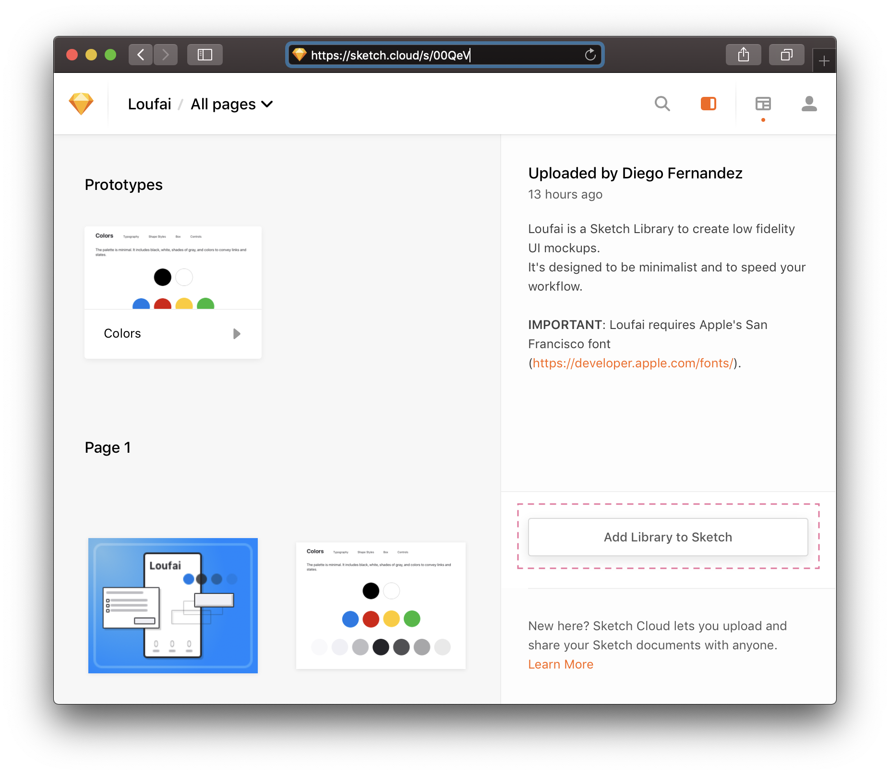

If you prefer you can [**download**](https://github.com/dfernandez79/loufai/releases/download/v1.0.1/Loufai.sketch) and manually install the library.

## Reference

### Colors

The palette is minimal. It includes black, white, shades of gray, and colors to convey links and states.

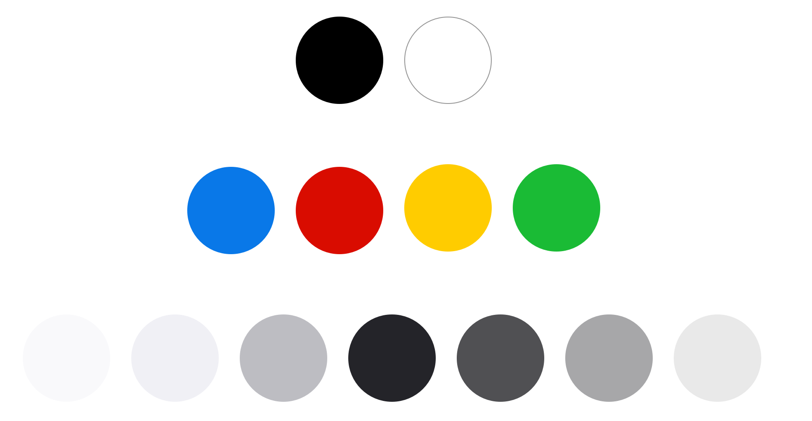

### Typography

Typography is based on iOS Guidelines but with fewer sizes and styles.
This library requires the [San Francisco font from Apple](https://developer.apple.com/fonts/). The 2019 version of San Francisco includes high-quality icons that are useful for mobile or web mockups. The [SF Symbols app](https://developer.apple.com/design/resources/#sf-symbols) it's a recommended companion to use this library.

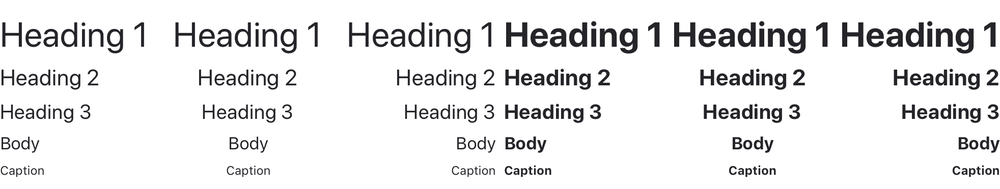

### Shape Styles

The shape styles define borders and shadows that are helpful to mockup UI controls.

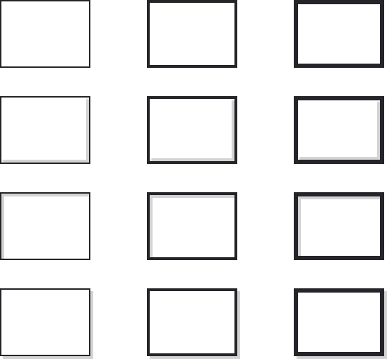

### Box

The Box is a symbol with three parts: Text Layout, Mask, Shape.

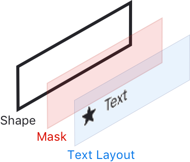

The **Text Layout** symbol determines how the text is displayed.

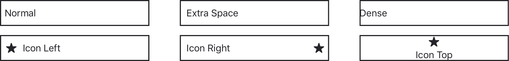

The **Mask** symbol is a viewport over the shape symbol. It also determines the size and position of the shape symbol.

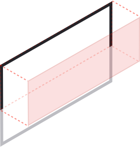

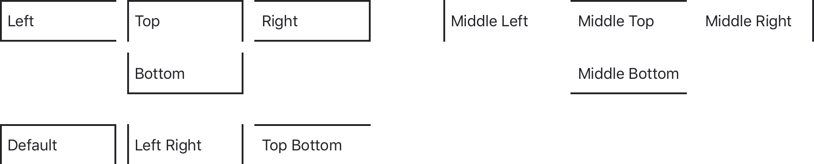

The **Shape** symbol is the box background. Combined with the other layers and shape styles, it produces a lot of combinations.

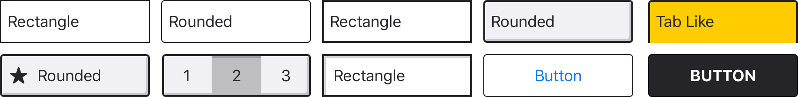

### Controls

Based on the Box symbol, controls are flexible and can be composed or decomposed to create low fidelity mockups.

#### Button

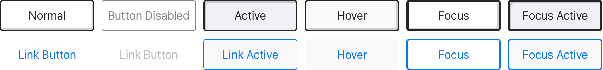

#### Checkbox

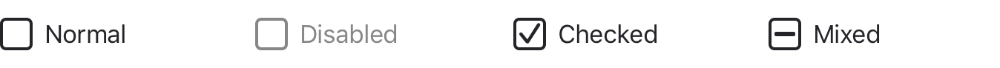

#### Radio Button

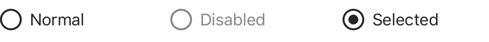

#### Toggle Button

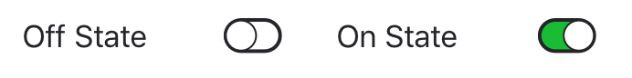

#### Dropdown

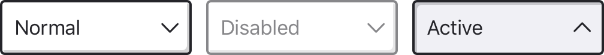

#### Text Input

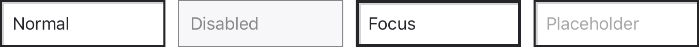

#### Search Box

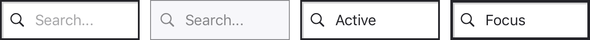

#### Tabs

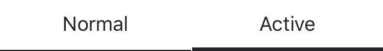

#### Segmented Control

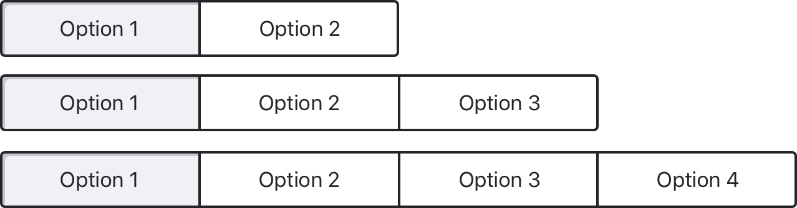

#### Dropdown List

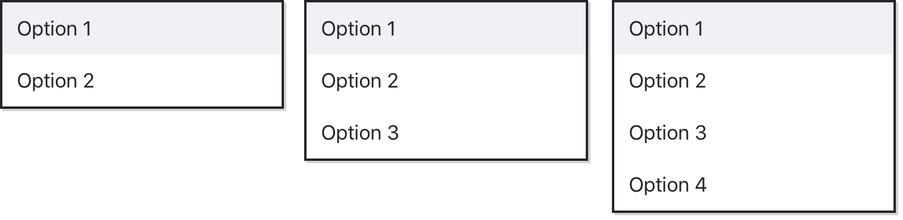

#### Dialog

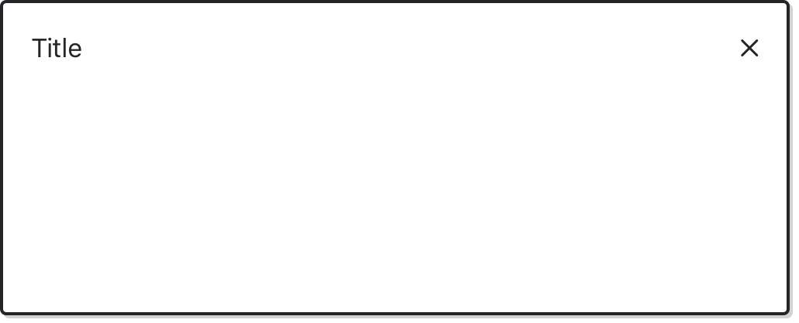

#### Mobile

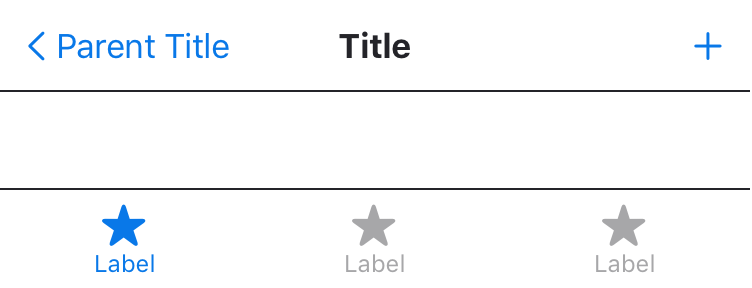

## Development

This repository uses [Git LFS](https://git-lfs.github.com), without it Sketch will fail to open `Loufai.sketch`.

## License

I wanted a permissive license (MIT), so you don't have to worry about it. However, I'm not a lawyer and I don't know how MIT matches with a Sketch Library. If you have concerns, let me know by creating an issue in this repository.
