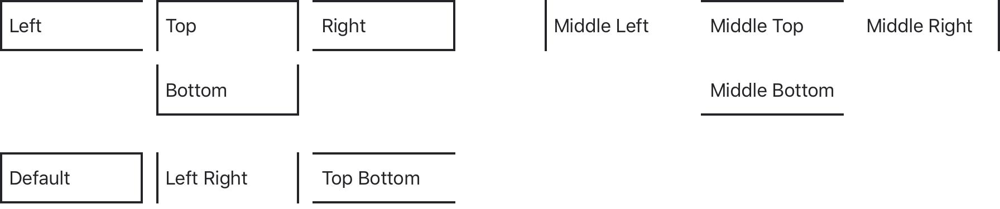

# Loufai

Loufai is a Sketch Library to create low fidelity UI mockups.

It's designed to be minimalist and to speed your workflow.

## Installation

Loufai requires [Apple's San Francisco font](https://developer.apple.com/fonts/).

Once that you installed San Francisco, the preferred method add Loufai as a library is to use [this Sketch Cloud link](https://sketch.cloud/s/00QeV).

If you prefer to manually download and install the library, use this zip file.

## Reference

### Colors

The palette is minimal. It includes black, white, shades of gray, and colors to convey links and states.

### Typography

Typography is based on iOS Guidelines but with fewer sizes and styles.
This library requires the [San Francisco font from Apple](https://developer.apple.com/fonts/). The 2019 version of San Francisco includes high-quality icons that are useful for mobile or web mockups. The [SF Symbols app](https://developer.apple.com/design/resources/#sf-symbols) it's a recommended companion to use this library.

### Shape Styles

The shape styles define borders and shadows that are helpful to mockup UI controls.

### Box

The Box is a symbol with three parts: Text Layout, Mask, Shape.

The **Text Layout** symbol determines how the text is displayed.

The **Mask** symbol is a viewport over the shape symbol. It also determines the size and position of the shape symbol.

The **Shape** symbol is the box background. Combined with the other layers and shape styles, it produces a lot of combinations.

### Controls

Based on the Box symbol, controls are flexible and can be composed or decomposed to create low fidelity mockups.

#### Button

#### Checkbox

#### Radio Button

#### Toggle Button

#### Dropdown

#### Text Input

#### Search Box

#### Tabs

#### Segmented Control

#### Dropdown List

#### Dialog

#### Mobile

## License

I wanted a permissive license (MIT), so you don't have to worry about it. However, I'm not a lawyer and I don't know how MIT matches with a Sketch Library. If you have concerns, let me know by creating an issue in this repository.
